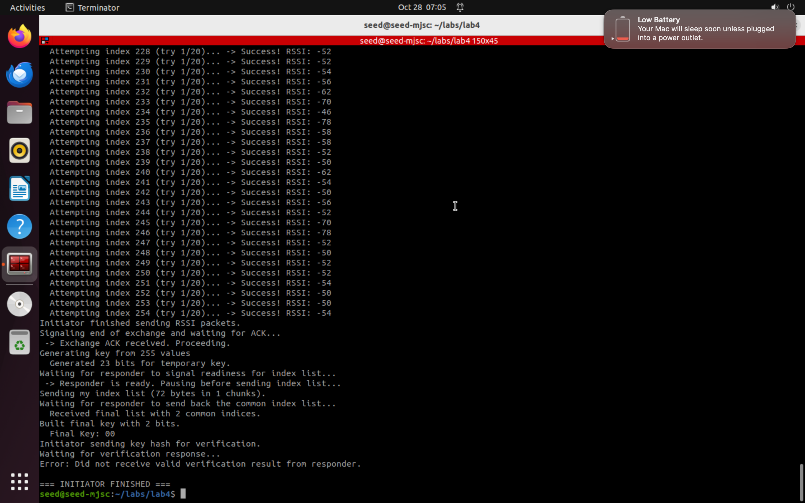
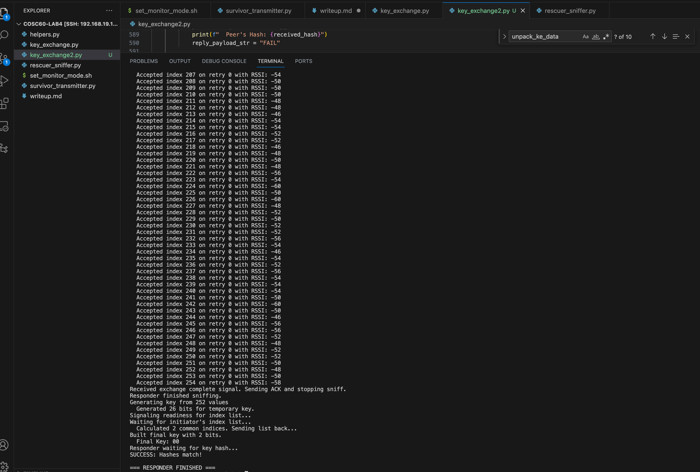

## Part 1: Search and Rescue

### Monitor Mode

- Research and describe what monitor mode is: _Monitor mode is a special mode for wifi network interfaces that allows the adapter to capture all wireless traffic on a specific channel. Not just the packets addressed to it_

- In your write-up, describe why setting the channel is important: _Setting the channel is important because wifi operates across dofferent frequency channels (1-11 for 2.4GHz, and 36-165 in 5GHz). If two devices are communicating over two different channels, they are not gonna be able to hear each other even if they are close in proximity._

- Provide terminal output from your script showing it successfully set monitor mode:
```
sudo ./set_monitor_mode.sh wlan0 11
[+] Setting wlan0 to monitor mode on channel 11...
[+] Verifying monitor mode...
        type monitor
        channel 11 (2462 MHz), width: 20 MHz (no HT), center1: 2462 MHz
[✓] wlan0 is now in monitor mode.
```

### Beacon Design

- Describe what information your beacon contains that would help rescuers: _Each beacon frame carries as its payload a vendor-specific information element that contains the OUI (that identifies a frame as a frame coming from a survivor), and a uuid to identify each survivor uniquely. It also contains a RadioTap layer from which we can probe the strength of the signal and calculate the regression slope to find out whether we are getting closer or further_

- Describe when/how often you will transmit these beacons: _These becons are transmitted every one second which are not too fast that they would exhaust the battery of the transmitter, but not too slow that the rescuer wouldn't get timely feedback. The rate is also configurable and could be dynamically controlled to allow for a slower transmission when the survivor battery goes low_

- Discuss the idea of using RSSI as a proxy for distance and give examples of where it could go wrong: _Using RSSI to tell if you are getting close or further from a transmitter is generally reliable in short time windows if you move slowly and take several readings. However, due to multipath or reflections that could happen in buildings or rubble, consturctive (RSSI spikes) or destructive (RSSI drops) interferences that are unrelated to true distance could happen.

- Is RSSI a good proxy for distance in this rescue use case?: _It's an imperfect proxy for distance; It's good for directional guidance (following the gradient) but it's poor for absolute distance estimation. Since the system's goal is to locate a nearby person and not to compute a precise coordinate, it generally serves its function in this case. Especially when combined with human judgement._

## Part 2: Secret Key Exchange

### Calculate a key on each device 

- Discuss reasonable values for z (the number of standard deviations).

At first we started with relatively low (.75) values for z because we didn't want too many bits to be dropped, but we ended up having to go all the way up to 1.8 for the sake of consistency. The downside is of course much shorter keys.

- Describe how bits should be included in a cryptographic key that will serve as a basis for long-term secure communication.

The bits from this lab aren't enough for a decent cryptographic key, but perhaps they could be used to seed key generation for both parties or to temporarily encrypt communication in order to store better long-term keys.


- Show evidence both devices independently computed the same key.

#### Initiator



#### Responder


